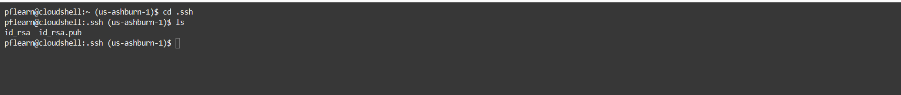

# Create Oracle Linux 8 System

## Introduction

Oracle Linux is a proven operating environment that is optimized for performance, scalability, reliability, and security. It
offers the most cost-effective and integrate

_Estimated Lab Time:_ 10 minutes

### Objectives

In this lab, you will be guided through the following tasks:

- Create a Compartment
- Create Virtual Cloud Network
- Create SSH Key on OCI Cloud
- Create Compute Instance
- Connect to Compute instance using SSH key

### Prerequisites

- An Oracle Trial or Paid Cloud Account

## Task 1: Create a Compartment

1. Click the **Navigation Menu** in the upper left, navigate to **Identity & Security** and select **Compartments**.

2. On the Compartments page, click **Create Compartment**.

   **Note:** Two Compartments, _Oracle Account Name_ (root) and a compartment for PaaS, were automatically created by the Oracle Cloud.

3. In the Create Compartment dialog box, in the **NAME** field, enter **on-prem**, and then enter a Description, select the **Parent Compartment**, and click **Create Compartment**.

    The following screen shot shows a completed compartment:

## Task 2: Create Virtual Cloud Network

1. Click **Navigation Menu**, **Networking**, then **Virtual Cloud Networks**  

2. Click **Start VCN Wizard**

3. Select 'Create VCN with Internet Connectivity'

    Click 'Start VCN Wizard'

4. Create a VCN with Internet Connectivity

    On Basic Information, complete the following fields:

    VCN Name:

    ```bash
    <copy>on-prem-VCN</copy>
    ```

    Compartment: Select  **on-prem**

5. Click 'Next' at the bottom of the screen

6. Review Oracle Virtual Cloud Network (VCN), Subnets, and Gateways

    Click 'Create' to create the VCN

7. The Virtual Cloud Network creation is completing

8. Click 'View Virtual Cloud Network' to display the created VCN

## Task 3: Create SSH Key on OCI Cloud Shell

The Cloud Shell machine is a small virtual machine running a Bash shell which you access through the Oracle Cloud Console (Homepage). You will start the Cloud Shell and generate a SSH Key to use  for the Bastion  session.

1. To start the Oracle Cloud shell, go to your Cloud console and click the cloud shell icon at the top right of the page. This will open the Cloud Shell in the browser, the first time it takes some time to generate it.

    

    

    _Note: You can use the icons in the upper right corner of the Cloud Shell window to minimize, maximize, restart, and close your Cloud Shell session._

2. Once the cloud shell has started, create the SSH Key using the following command:

    ```bash
    <copy>ssh-keygen -t rsa</copy>
    ```

    Press enter for each question.

    Here is what it should look like.

    

3. The public  and  private SSH keys  are stored in ~/.ssh/id_rsa.pub.

4. Examine the two files that you just created.

    ```bash
    <copy>cd .ssh</copy>
    ```

    ```bash
    <copy>ls</copy>
    ```

    

    Note in the output there are two files, a _private key:_ `id_rsa` and a _public key:_ `id_rsa.pub`. Keep the private key safe and don't share its content with anyone. The public key will be needed for various activities and can be uploaded to certain systems as well as copied and pasted to facilitate secure communications in the cloud.

## Task 4: Create Compute instance

1. Before creating the Compute instance open a notepad

2. Do the followings steps to copy the public SSH key to the  notepad

    Open the Cloud shell

    Enter the following command

    ```bash
    <copy>cat ~/.ssh/id-rsa.pub</copy>
    ```

3. Copy the id_rsa.pub content the notepad

4. To launch a Linux Compute instance, go to
    Navigation Menu
    Compute
    Instances

5. On Instances in **on-prem** Compartment, click  **Create Instance**

6. On Create Compute Instance

    Enter Name

    ```bash
    <copy>on-prem-mysql</copy>
    ```

7. Make sure **(on-prem)** compartment is selected

8. On Placement, keep the selected Availability Domain

9. On Image and Shape, keep the selected Image, Oracle Linux 8

10. Select Instance Shape: VM.Standard.E2.2

11. On Networking, make sure '**on-prem-VCN**' is selected

    'Assign a public IP address' should be set to Yes

12. On Add SSH keys, paste the public key from the notepad.

13. Click '**Create**' to finish creating your Compute Instance.

14. The New Virtual Machine will be ready to use after a few minutes. The state will be shown as 'Provisioning' during the creation

15. The state 'Running' indicates that the Virtual Machine is ready to use.

## Task 5: Install MySQL Community

1. Copy the public IP address of the active Compute Instance to your notepad

    - Go to Navigation Menu
            Compute
            Instances
    - Click the `on-prem-mysql` Compute Instance link

    - Copy `on-prem-mysql` plus  the `Public IP Address` to the notepad

2. Indicate the location of the private key you created earlier.

    Enter the username **opc** and the Public **IP Address**.

    Note: The **on-prem-mysql**  shows the  Public IP Address 

    (Example: **ssh -i ~/.ssh/id_rsa opc@132.145.170...**)

    ```bash
    <copy>ssh -i ~/.ssh/id_rsa opc@<your_compute_instance_ip></copy>
    ```

3. Install MySQL Community

    ```bash
    <copy>sudo yum install mysql-server</copy>
    ```

## Task 6:  Start MySQL Community

1. Start MySQL if not alread started

    a.

    ```bash
    <copy>sudo systemctl start mysqld</copy>
    ```

    b.

    ```bash
    <copy>sudo systemctl status mysqld</copy>
    ```

2. Login to MySQL with password

    ```bash
    <copy>mysql -uroot -p -h localhost</copy>
    ```

3. Change the **root** password

    ```bash
    <copy>ALTER USER 'root'@'localhost' IDENTIFIED BY 'Welcome#123';</copy>
    ```

4. Check to see which databases are installed by default

    ```bash
    <copy>show databases;</copy>
    ```

5. To see which version of MySQL you are using submit the following command

    ```bash
    <copy>show variables like "%version%";</copy>
    ```

6. Quit MySQL

    ```bash
    <copy>\q</copy>
    ```

## Task 7:  Load Employees database

1. Create and go into  workshop folder
    a.

    ```bash
    <copy>sudo mkdir /workshop</copy>
    ```

    b.

    ```bash
    <copy>cd /workshop</copy>
    ```

2. Get and unzip database file
    a.

    ```bash
    <copy>sudo curl -u vsftp_user:vsftp_Pa33w0rd  -o workshop.tar.gz ftp://129.158.254.37/workshop.tar.gz </copy>
    ```

    b.

    ```bash
    <copy> sudo tar xvf workshop.tar.gz</copy>
    ```

   c.

    ```bash
    <copy>sudo ln -s /usr/lib64/libtinfo.so.6.1 /usr/lib64/libtinfo.so.5</copy>
    ```

3. Load  Employee database into MySQL

   a.

    ```bash
    <copy>cd /workshop/database/employees/</copy>
    ```

   b.

    ```bash
    <copy>mysql -uroot -p  < ./employees.sql</copy>
    ```

   c.

    ```bash
    <copy>mysql -uroot -p</copy>
    ```

   d.

    ```bash
    <copy>Show Databases</copy>
    ```

## Task 8:  Migration Discussion

1.  We will migrate from on-prem to  OCI HeatWave DB System. 


2. Here an overview of the Migration process:
    - Install MySQL shell utility on Amazon RDS instance
    - Creae Object Storage Bucket
    - Setup Configuration to  access object storage
    - Run the Mysql shell dump command to push the data  from the other cloud to OCI object storage
    - On the other side, you create and load the Oracle MySQL HeatWave Database instance with  the Mysql shell load command
    **And you’re done.**
3. Create Object Storage Bucket
    [Create Bucket]( https://docs.oracle.com/en-us/iaas/Content/Object/Tasks/managingbuckets.htm)

1. Click the **Navigation Menu** in the upper left, navigate to **Storage** and select **Bucket**.

2. Set name to : **bucket-on-prem**

3. Generate an API Signing Key and config

    [API Congi](https://docs.oracle.com/en-us/iaas/Content/API/Concepts/apisigningkey.htm)

4. Move Config and  keys to  on-prem-mysql compute from your local machine

    a.

    ```bash
    <copy> scp config opc@158.101.98.146:/home/opc/</copy>
    ```

    b.

    ```bash
    <copy>scp oci_pflearn.pem opc@158.101.98.146:/home/opc/</copy>
    ```

    c.

    ```bash
    <copy>scp oci_pflearn_public.pem opc@158.101.98.146:/home/opc/</copy>
    ```

    d.

    ```bash
    <copy> mysqlsh -uroot -p  --sql</copy>
    ```

5. Go to on-prem-mysql and setup .oci folder(make sure you are on /home/opc folder)

    a.

    ```bash
    <copy>mkdir .oci</copy>
    ```

    b.

    ```bash
    <copy> cd .oci</copy>
    ```

    c.

    ```bash
    <copy> mv config .oci</copy>
    ```

    d.

    ```bash
    <copy> mv oci_* .oci</copy>
    ```

## Task 9:  Export Employees database


1. Install MySQL Shell

    ```bash
    <copy>sudo yum install mysql-shell -y</copy>
    ```

2. Login into MySQL Shell

    ```bash
    <copy> mysqlsh -uroot -p  --sql</copy>
    ```

3. Dump MySQL Instance to Object Storage Bucket

    ```bash
    util.dumpInstance("mysql", {osBucketName: "bucket-on-prem", threads: 2, ocimds: true,     compatibility: ["strip_restricted_grants", "strip_definers", "ignore_missing_pks",     "skip_invalid_accounts"]})
    ```

You may now proceed to the next lab.

## Acknowledgements

- **Author** -Perside Foster, MySQL Solution Engineer

- **Last Updated By/Date** - Perside Foster, MySQL Solution Engineer, July 2022
